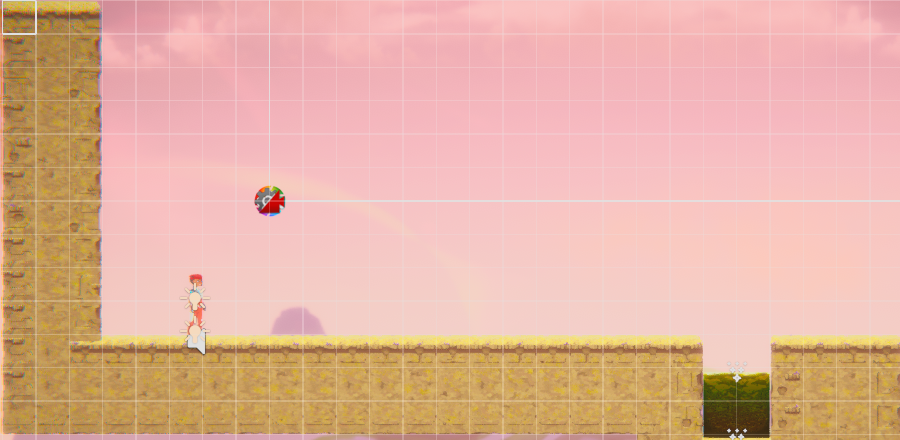

[](https://classroom.github.com/a/YyUO0xtt)
# COMP2150  - Level Design Document
### Name: Boston Rix
### Student number: 46618538

This document discusses and reflects on the design of your platformer level for the Level Design assessment. It should be 1500 words. Make sure you delete this and all other instructional text throughout the document before checking your word count prior to submission. Hint: You can check word count by copying this text into a Word or Google doc.

Your document must include images. To insert an image into your documentation, place it in the "DocImages" folder in this repo, then place the below text where you want the image to appear:

```

```

Example:


## 1. Player Experience (~700 words)
Outline and justify how your level design facilitates the core player experience goals outlined in the assignment spec. Each section should be supported by specific examples and screenshots of your game encounters that highlight design choices made to facilitate that particular experience.

### 1.1. Discovery
What does the player learn? How does your encounter and broader level design facilitate learning in a way that follows good design practice?
In the game, the discovery aspect of the player experience unfolds mostly within the tutorial stage (section 1). Through following the Assignment Outline, Mechanics and dynamics were introduced individually, and in a safe manor as to not complicated the experience of the player. The first section of the game consisted of a relatively safe linear experience of the games features and dynamics.
Through this, the player is provided the chance to grasp how their player interacts with the obstacles within the world.


### 1.2. Drama
What is the intensity curve? How does your design facilitate increasing yet modulating intensity, with moments of tension and relief? 

### 1.3. Challenge
What are the main challenges? How have you designed and balanced these challenges to control the difficulty curve and keep the player in the flow channel?

### 1.4. Exploration
How does your level design facilitate autonomy and invite the player to explore? How do your aesthetic and layout choices create distinct and memorable spaces and/or places?

## 2. Core Gameplay (~400 words) Story boards
### 2.1. Acid

The player start by learning that acid respawns the player, rather than just damages, as this is the closest obstical from the respawn point, and thus an optimal first obstical.
### 2.2. Pushable blocks
Following this, the push box is introduced and requires interaction to progress.
### 2.3. Weapon Pickup (Staff) & Chompers
Then the staff is provided to the player, and a chomper closely following, representing that both are close range.
single enemy with no obstacles or further challenges around it.
### 2.4. Health Pickups
after 2 instances of possible health loss, player is provided the chance to heal.
### 2.5. Weapon Pickup (Gun) & Spitters
The gun is then introduced, followed by a spitter a fair bit back, place in tight spot for enemy to reduce spitters movements, perfect height for use of gun. As before, representing that both are a farther range of combat than prior.
### 2.6. Spikes
used in basic parkour to present the threat that is the spikes. player can still be damaged but it is not game ending.
### 2.7. Moving Platforms
used as a connective space to change elevation and take the player to the next section to progress and out of the tutorial section.
### 2.8. Passthrough Platforms
Used as a one way door following the moving platform. As such, once you have made it into section 2, you cannot go back to the tutorial.
### 2.9. Checkpoints
introduced after the player has excited the tutorial.
### 2.10. Keys
After completing the section 2 puzzle, the player is presented with the first of three keys.
It is impossible to pass this key without picking it up, and therefore presents the player with its importance in finishing the game.


## 3. Spatiotemporal Design
A section on Spatiotemporal Design, which includes your molecule diagram and annotated level maps (one for each main section of your level). These diagrams may be made digitally or by hand, but must not be created from screenshots of your game. The annotated level maps should show the structure you intend to build, included game elements, and the path the player is expected to take through the level. Examples of these diagrams are included in the level design lectures.

No additional words are necessary for this section (any words should only be within your images/diagrams).
 
### 3.1. Molecule Diagram

### 3.2. Level Map – Section 1

### 3.3.	Level Map – Section 2

### 3.4.	Level Map – Section 3

## 4. Iterative Design (~400 words)
Reflect on how iterative design helped to improve your level. Additional prototypes and design artefacts should be included to demonstrate that you followed an iterative design process (e.g. pictures of paper prototypes, early grey-boxed maps, additional storyboards of later gameplay sequences, etc.). You can also use this section to justify design changes made in Unity after you drew your level design maps shown in section 3. 

You should conclude by highlighting a specific example of an encounter, or another aspect of your level design, that could be improved through further iterative design.

## Generative AI Use Acknowledgement

Use the below table to indicate any Generative AI or writing assistance tools used in creating your document. Please be honest and thorough in your reporting, as this will allow us to give you the marks you have earnt. Place any drafts or other evidence inside this repository. This form and related evidence do not count to your word count.
An example has been included. Please replace this with any actual tools, and add more as necessary.


### Tool Used: ChatGPT
**Nature of Use** Finding relevant design theory.

**Evidence Attached?** Screenshot of ChatGPT conversation included in the folder "GenAI" in this repo.

**Additional Notes:** I used ChatGPT to try and find some more relevant design theory that I could apply to my game. After googling them, however, I found most of them were inaccurate, and some didn't exist. One theory mentioned, however, was useful, and I've incorporated it into my work.

### Tool Used: Example
**Nature of Use** Example Text

**Evidence Attached?** Example Text

**Additional Notes:** Example Text


