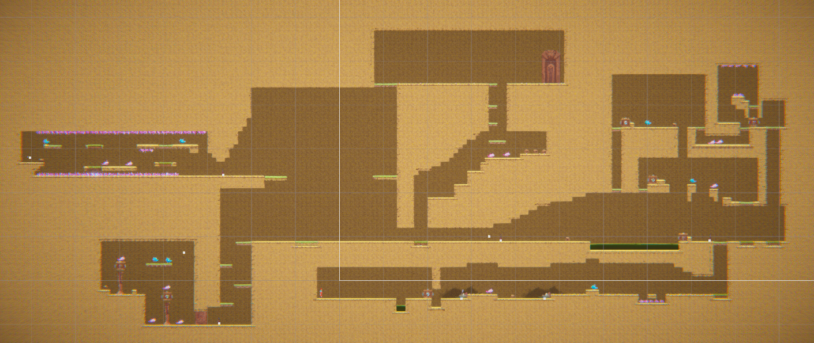
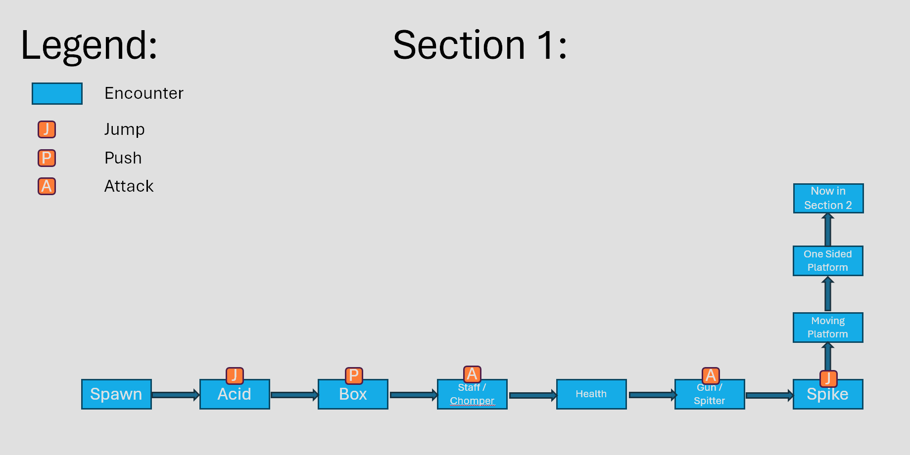
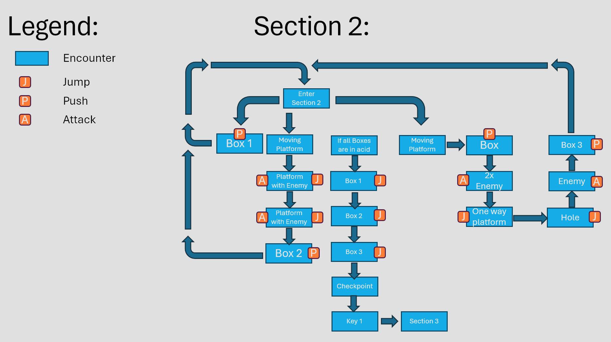
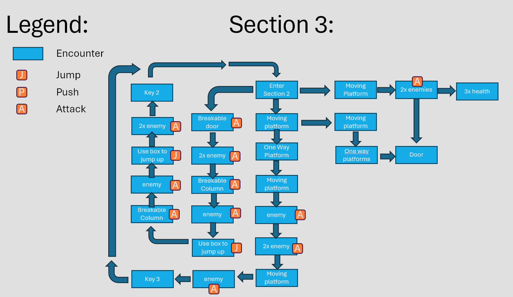

# COMP2150  - Level Design Document
### Name: Boston Rix
### Student number: 46618538

## 1. Player Experience (~700 words)
### 1.1. Discovery
In the game, the discovery aspect of the player experience unfolds mostly within the tutorial stage (section 1). Through following the Assignment Outline, Mechanics and dynamics were introduced individually, and in a safe manor as to not complicated the experience of the player. The first section of the game consisted of a relatively safe linear experience of the games features and dynamics. 
Through this, the player is provided the chance to grasp how their player interacts with the obstacles within the world.

### 1.2. Drama
Section 1 starts the player off with easy to overcome hurdles, and stays relatively slow in pace and intensity. This is all that is needed for a tutorial section.  
Section 2 provides a simple puzzle for the player, seperating the two routes with movement platforms serving as connective space. From the connective space the intensity is low, but as both routes require either a movement mechanic or a logical mechanic aswell as a combat mechanic the intensity rises, before falling when the route is cleared and the box is pushed into the acid. Once the puzzle is solved, the Intensity rises again as the player must now parkour on the floating boxes across a river of acid, to get to the other side, where their efforts are rewarded by a checkpoint and the first of three keys. 
Section 3 can be divided into 3 areas, each sharing a connective space, with the door having an alternative route available. the final 2 puzzles start with a low intensity, after exiting the connective space, then ramp up as the puzzle/challenge is solved and enemies are faced concurrently. As with section 2, the players efforts are rewarded with a key for completing the challenge.
The final route to the door is relatively simple and low in intensity, and relies on either the players explorative ability or memory if they had found it prior.  
To Sumarise, the intensity curve is appropriately filled with ups and downs, and uses connective space to seperate the appropriate areas.

### 1.3. Challenge
Section 1's main challenge is figuring out the games core mechanics, and gaining an understanding of how to interact with the games world.  
Section 2's main challenge is overcoming obstacles, and solving the puzzle of how to cross a large river of acid without burning. The sections difficulty curve has been controlled by not heavily punishing failure, where falls in the routes do not kill you, but rather reset you to the sections entrance. 
Section 3's main challenge is exploring new mechanics and gameplay that hadnt been used extensively prior. Such as area 1's destructable objects and area 2's minimal jump design. This sections difficulty curve has been controlled by splitting the areas into themes, where the player isnt overwhelmed by mechanics, but instead given a select variety of mechanics to work with.  

### 1.4. Exploration

While section 1 does not provide much in terms of exploration, sections 2 and 3 provide alternate routes, and do not restrict the direction or actions a player must travel, just that they must complete an objective to progress.  
In section 2, this objective is to push enough boxes into the acid to jump accross. While the player needs these boxes to progress, the order in which they attempt the boxes is entirely up to them and not restricted by the design.  
In section 3, this objective is to collect the two remaining keys and make your way to the door to finish. All of the areas of interest (2 keys and the door) are all accessable through a single connective space, with an alternate route to the door also being provided that rewards the player for their exploration through additional health pickups.  
 
In terms of easthetic and layout, each area has a distinct theme that ties into the challenge.  
Section 2's routes are both explorative of the boxes push mechanic, and the movement abilities of the character.  
Section 3's routes are reflected of the challenge they emphasis, Area 1's being "Height" or the y-axis, as the aim is to destroy the columns to drop boxes that enable upwards movement. and Area 2's being a lack of height, emphasising x-axis movement over y axis movement, resulting in a wide room with restrictions above and below the player (spikes).  

## 2. Core Gameplay
### 2.1. Acid

The player start by learning that acid respawns the player, rather than just damages, as this is the closest obstical from the respawn point, and thus an optimal first obstical.
### 2.2. Pushable blocks

Following this, the push box is introduced and requires interaction to progress.
### 2.3. Weapon Pickup (Staff) & Chompers

Then the staff is provided to the player, and a chomper closely following, representing that both are close range.
single enemy with no obstacles or further challenges around it.
### 2.4. Health Pickups

after 2 instances of possible health loss, player is provided the chance to heal.
### 2.5. Weapon Pickup (Gun) & Spitters

The gun is then introduced, followed by a spitter a fair bit back, place in tight spot for enemy to reduce spitters movements, perfect height for use of gun. As before, representing that both are a farther range of combat than prior.
### 2.6. Spikes

used in basic parkour to present the threat that is the spikes. player can still be damaged but it is not game ending.
### 2.7. Moving Platforms & Passthrough Platforms

Moving Platforms used as a connective space to change elevation and take the player to the next section to progress and out of the tutorial section.

Passthrough Platforms used as a one way door following the moving platform.
### 2.9. Checkpoints

introduced after the player has excited the tutorial.
### 2.10. Keys

After completing the section 2 puzzle, the player is presented with the first of three keys. 
It is impossible to pass this key without picking it up, and therefore presents the player with its importance in finishing the game.

## 3. Spatiotemporal Design
### 3.1. Section 1

### 3.2. Section 2

### 3.3. Section 3

## 4. Iterative Design
As the tileset was made from the get go, Grey-boxed mapping wasnt an option. As such, rather than grey-boxed mapping, the basic layout of the map was made with little filled in, this still allowed me to playtest each section with minimal design, adding features as I went along.    
This worked extremely well in Section 2, where I originally aimed to try and get a moving platform to move a pushable box across the acid, after many failed attempts however, I realised that the Box's had a floating effect, something in which I could use to make a parkour across the acid moat. This floating effect, meant that the box's could be used to "unlock" a path through the acid. With this in mind, I design the first route within the game to take the player to the second box.

After some playtesting of this route, it felt as if it was lacking something, and seemed bland with just being a parkour feature. Thus, Enemies were added to provide more challenge to the route.

Continuing to playtest the sections puzzle, it still felt too short for a "hurdle puzzle" (Required to progress through the level), and I decided to mess around with adding a third route, and extending the acid pool to compensate for this change.

Through Iterative design, a botched idea that wasnt working turned into something completely else, that worked entirely as intended and didn't limit the player into a severely linear playstyle (while this puzzle was a hurdle to progress to the next section, it contains two routes that can be completed regardless of each other but are both required).    

To Conclude, I believe the level turn out quite well, with each section being tested until it "felt right". 
However, if I had more time to dedicate on the project, I believe that the Section 3 Puzzle 2 part of the map would benefit from further improvement through iterative design.
While the puzzle's theme revolves around minimal jumping (an idea I got when sitting next to a friend playing geometry dash), in order to avoid the spikes on the roof, I believe that it could be vastly improved and made to be more fun through that playtesting style.